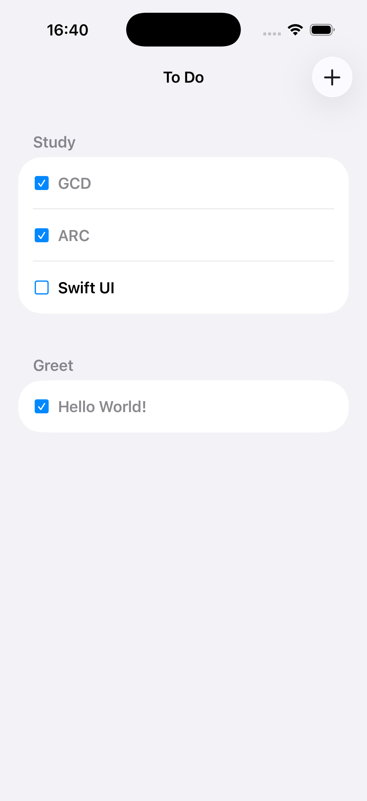
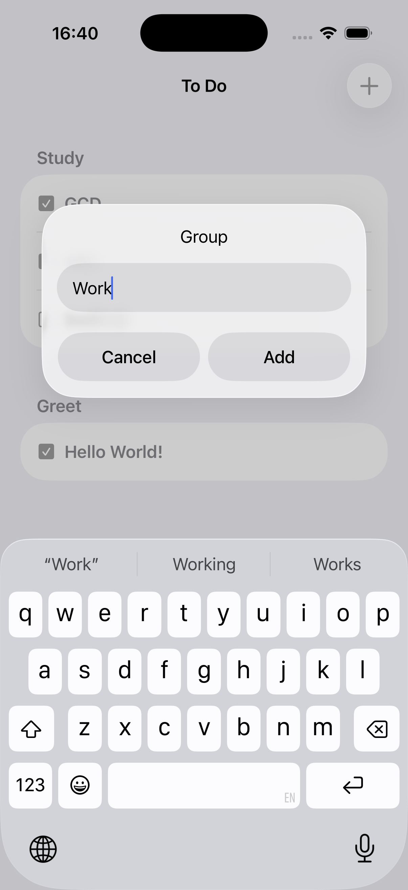
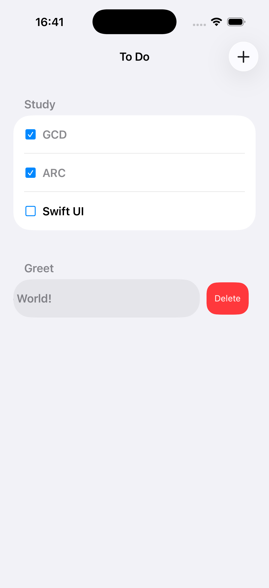

# ToDoList

## Описание

iOS-приложение для управления списком задач (ToDo), разработанное для практики работы с CoreData и Realm. Приложение позволяет создавать группы задач и управлять отдельными элементами внутри них.

## Задача

Попрактиковаться с сохранением объектов в CoreData и/или Realm. Создать приложение из двух экранов: первый экран - таблица с сохраненными данными, второй экран - создание модели и сохранение.

## Стек технологий

### Архитектура
- **Слоистая архитектура** с разделением на:
  - **UI Layer** - представление данных пользователю
  - **Domain Layer** - бизнес-логика приложения
  - **Data Layer** - работа с хранилищем данных

### Технологии
- **Swift** - язык программирования
- **UIKit** - фреймворк для построения пользовательского интерфейса
- **CoreData** - фреймворк для работы с базой данных (основная реализация)
- **Realm** - альтернативная реализация хранилища данных (доступна на ветке `feature/realm`)

### Структура проекта
- **App/** - точка входа приложения, конфигурация зависимостей
- **UI/** - пользовательский интерфейс (ViewControllers, Cells)
- **Domain/** - бизнес-модели и менеджеры
- **Data/** - репозитории для работы с данными (CoreData, Realm)

## Особенности реализации

Проект реализован с использованием паттерна **Repository**, что позволяет легко переключаться между различными источниками данных без изменения бизнес-логики и UI-слоя.

### Переключение на Realm

В проекте предусмотрена возможность переключения на использование Realm вместо CoreData. Реализация доступна на ветке `feature/realm`. Благодаря архитектуре с протоколом `ToDoRepository`, переключение происходит без вмешательства в бизнес-логику (`ToDoManager`) и UI-слой (`ToDoViewController`). Достаточно изменить инициализацию репозитория в `AppContainer.swift`.

## Скриншоты

<table>
  <tr>
    <td style="border: none;"></td>
    <td style="border: none;"></td>
    <td style="border: none;"></td>
    <td style="border: none;"></td>
  </tr>
</table>

